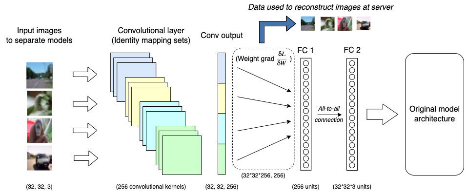

# LOKI: Large-scale Data Reconstruction Attack against Federated Learning through Model Manipulation


*Attack overview*

This repo contains basic code for the attack in the paper <em>LOKI: Large-scale Data Reconstruction Attack against Federated Learning through Model Manipulation</em> [IEEE Digital Library](https://www.computer.org/csdl/proceedings-article/sp/2024/313000a030/1RjEa6sC0I8)     ([arXiv](https://arxiv.org/abs/2303.12233)). The attack is simplified to simulate how the model of a client would update during FedAVG federated learning training. Aggregation is simulated to avoid the need to store the weights/gradients of all updates when there are many clients.

```
Zhao J, Sharma A, Elkordy A, Ezzeldin Y, Avestimehr S, Bagchi S
LOKI: Large-scale Data Reconstruction Attack against Federated Learning through Model Manipulation 
Accepted to IEEE Symposium Security & Privacy, 2024

```

Below is an algorithmic description of the code:

- Import Libraries:
  - Import necessary libraries, including NumPy, PIL, Matplotlib, PyTorch, torchvision, and torchmetrics.
  - Set the device to "cuda" if available; otherwise, use "cpu".
- Load Dataset:
  - Choose the dataset (mnist or cifar) and set relevant parameters.
  - Define transformations for preprocessing the images.
- Utility Functions:
  - Define functions for converting labels to one-hot encoding.
  - Implement a function (norm_image) for normalizing image pixel values.
  - Define a function (psnr) for calculating the Peak Signal-to-Noise Ratio.
- Compute Average Pixel Intensity Distribution:
  - Load the dataset and compute the average pixel intensity distribution of images.
    - 
  - Visualize the distribution using a histogram.
    - 
- Define Imprint Layer:
  - Implement a custom neural network layer (imprintLayer) consisting of a convolutional layer and two fully connected layers.
  - The layer is designed for imprinting custom convolutional parameters and reconstructing data.
- Define Helper Functions:
  - Implement a function (get_bins) to compute bins for imprinting layer bias.
  - Set up parameters such as batch size, number of clients, and convolutional sizes.
- Generate Client Data:
  - Randomly select a batch of images for each client from the dataset.
  - Create one-hot labels for the selected images.

- Run the Attack:
  - Initialize parameters like the number of bins, convolutional scaling factor, and the number of epochs.
  - Iterate over clients:
    - Initialize an imprint layer and a model (either ResNet or a single imprint layer).
    - Perform local training iterations with a custom loss function.
    - Track activations and gradients for reconstructed data points.
    - Evaluate image quality metrics (PSNR, SSIM, LPIPS) if enabled.
    - Summarize leakage statistics.
- Display Results:
  - Print the number of clients, total number of images, total leaked images, and leakage rate.
  - Print average metrics if enabled.

- Visualize Reconstructions:
  - Plot reconstructed images for a specific client.
    - 
  - Display ground truth images for comparison.
    - 


### Note:

- The code generates a synthetic federated learning environment and simulates the LOKI attack to reveal sensitive information across multiple clients.
- It leverages a custom imprint layer and computes various metrics to evaluate the success of the attack.
- Visualization outputs include histograms, leakage statistics, and reconstructed images for analysis.
